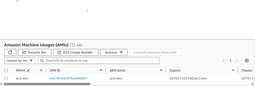

# seamlesshr infrastructure
This infrastructur consist of an EC2 autoscaling group, where the sample application will be deployed, a vpc and its components like two public subnets and one private subnet, a Nat gateway for internet access to resources in the private subnet, an internet gateway and an application load balancer.
To ensure a consistent configuration for our autoscaling group and ensure a faster satart up time, we baked an AMI with the desired configiration leveraging on "packer".
Packer is an open source tool for creating identical machine images for multiple platforms from a single source configuration. Packer is lightweight, runs on every major operating system, and is highly performant, creating machine images for multiple platforms in parallel.
configurations like the ami type, root volume size, installing dockr and docker compose have been baked into the AMI as against running the same script through user data. This will increase the start up time of the instance when an autoscaling action is triggered.
Go to the `packer` folder and `ec2-image` and change the values in `template.json` according to your specification and run:

`packer init` (for initialization)

`packer validate template.json` (to ensure that the configuration is correct)

`packer build template.json` (to build the AMI)



## Terraform
Terraform is an infrastructure as code tool that lets you define both cloud and on-prem resources in human-readable configuration files that you can version, reuse, and share.Terraform can manage low-level components like compute, storage, and networking resources, as well as high-level components like DNS entries and SaaS features.
<a href="https://developer.hashicorp.com/terraform/intro" target="_blank">more</a>

I have leverage terraform modules to be able to ensure re-usability and a uniform configuration across multiple environments or regions.
th configuration for the individual modules can be located in the `modules` directory but the creation of resource can be done through the `autoscaling` directory.
the `backend.tf` is a definition of the s3 bucket and dynamodb(for mantaining state lock) resources which I used as a remote backend.
example usage:
```terraform
  module "asg" {
  source                         = "../modules/ec2-autoscaling"
  createdby                      = var.createdby
  project                        = "seamlessHR"
  owners                         = "651611223190"
  key_name                       = "seamlesshr"
  min_size                       = 1
  desired_capacity               = 1
  max_size                       = 5
  vpc_zone_identifier            = module.vpc.public_subnet_id
  security_groups                = module.vpc.sg_id
  lb_subnets                     = module.vpc.public_subnet_id
  target_port                    = 80
  target_protocol                = "HTTP"
  vpc_id                         = module.vpc.vpc_id
  listener_port                  = "443"
  listener_protocol              = "HTTPS"
  certificate_arn                = var.certificate_arn
  allowed_cidrs                  = [var.allowed_cidrs]
  source_security_group_id       = module.vpc.sg_id
  depends_on                     = [module.vpc]
}
```
