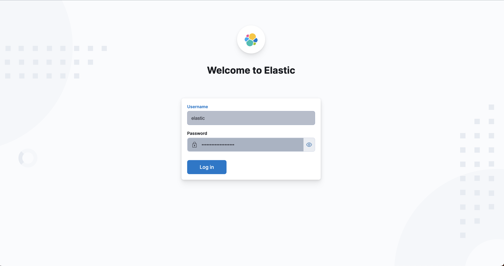

## ELK STACK
What is the ELK Stack?
The ELK stack is an acronym used to describe a stack that comprises three popular projects: Elasticsearch, Logstash, and Kibana. Often referred to as Elasticsearch, the ELK stack gives you the ability to aggregate logs from all your systems and applications, analyze these logs, and create visualizations for application and infrastructure monitoring, faster troubleshooting, security analytics, and more.

### E = Elasticsearch
Elasticsearch is a distributed search and analytics engine built on Apache Lucene. Support for various languages, high performance, and schema-free JSON documents makes Elasticsearch an ideal choice for various log analytics and search use cases. 

### L = Logstash
Logstash is an open-source data ingestion tool that allows you to collect data from various sources, transform it, and send it to your desired destination. With prebuilt filters and support for over 200 plugins, Logstash allows users to easily ingest data regardless of the data source or type. 

Logstash is a lightweight, open-source, server-side data processing pipeline that allows you to collect data from various sources, transform it on the fly, and send it to your desired destination. It is most often used as a data pipeline for Elasticsearch, an open-source analytics and search engine. Because of its tight integration with Elasticsearch, powerful log processing capabilities, and over 200 prebuilt open-source plugins that can help you easily index your data, Logstash is a popular choice for loading data into Elasticsearch.

### K = Kibana
Kibana is a data visualization and exploration tool used for log and time-series analytics, application monitoring, and operational intelligence use cases. It offers powerful and easy-to-use features such as histograms, line graphs, pie charts, heat maps, and built-in geospatial support. Also, it provides tight integration with Elasticsearch, a popular analytics and search engine, which makes Kibana the default choice for visualizing data stored in Elasticsearch.

## How does the ELK stack work?
Logstash ingests, transforms, and sends the data to the right destination.
Elasticsearch indexes, analyzes, and searches the ingested data.
Kibana visualizes the results of the analysis.
What does the ELK stack do?
The ELK stack is used to solve a wide range of problems, including log analytics, document search, security information and event management (SIEM), and observability. It provides the search and analytics engine, data ingestion, and visualization.

Apart from the core components mentioned, we have a filebeat which is a lighter log shipper. I have used the filebeat to ship the logs directly to elasticsearch in our case. Apart from filebeat, there are other beats designed to ship various kinds of information eg: metricbeat, packetbeats etc.

## Why is the ELK stack important?
The ELK stack fulfills a need in the log analytics space. As more and more of your IT infrastructure moves to public clouds, you need a log management and analytics solution to monitor this infrastructure and process any server logs, application logs, and clickstreams. The ELK stack provides a simple yet robust log analysis solution for your developers and DevOps engineers to gain valuable insights on failure diagnosis, application performance, and infrastructure monitoring—at a fraction of the price.

## Prometheus and Grafana
Prometheus is a monitoring solution for storing time series data like metrics. Grafana allows to visualize the data stored in Prometheus (and other sources).
It excels at data acquisition through its custom query language, which allows you to select and aggregate time-series data. This data can be viewed inside Prometheus's expression browser or transferred to external systems via its HTTP API.

Grafana is an open-source data analytics and visualization web application created by Grafana Labs. It lets you visualize time series data by compiling them into charts, graphs, or maps and it even provides alerting when connected to supported data sources.

